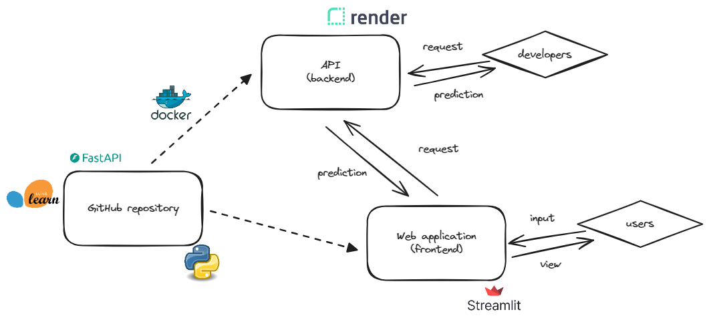

# 🏡 Real Estate Price Prediction - Immo Eliza - deployment

## 🏢 Description

Welcome to the immo-eliza-deployment repository where I have deployed a machine learning model that predicts real estate prices through an API endpoint. This solution consists of a FastAPI backend service deployed on Render and a frontend web application using Streamlit. 



## 📦 Repo structure
```.
├── api/
│ |── app.py
| ├── predict.py
├── data/
│ ├── houses.csv
├── model/
| ├── RandomForest_model.pkl
| ├── encoding.pkl
├── streamlit/
│ |── app.py
├── .gitignore
├── architecture.png
├── Dockerfile
├── predict.py
├── README.md
└── requirements.txt
```

## 👩‍💻 Usage

### API
To use API follow this URL: https://immo-eliza-vma8.onrender.com/docs

Use ```predict``` endpoint to get price estimations.

- JSON Input Structure

```
{
  "subproperty_type": "string",
  "region": "string",
  "province": "string",
  "zip_code": 0,
  "construction_year": 0,
  "total_area_sqm": 0,
  "nbr_bedrooms": 0,
  "equipped_kitchen": "string",
  "terrace_sqm": 0,
  "garden_sqm": 0,
  "state_building": "string",
  "primary_energy_consumption_sqm": 0,
  "heating_type": "string",
  "other_amenities": 0
}

```
- Response body 
```
{
  "price": 0
} 
```
### Streamlit

The Streamlit app provides a user-friendly interface allowing non-technical stakeholders to input property details and receive price predictions.

To use streamlit application follow this website: https://immo-eliza-prediction.streamlit.app/

### Installation

```
# Clone the repository
git clone 

# Install dependencies
pip install -r requirements.txt

# Run the FastAPI server locally
uvicorn api.app:app --reload

# Launch the Streamlit app locally
streamlit run streamlit/app.py

```
## ⏱️ Timeline

This project took 5 days for completion.

## 📌 Contributors
This project was done as part of the AI Boocamp at BeCode.org. 

Find me on [LinkedIn](https://www.linkedin.com/in/veena-bhawani-b41804111/) for collaboration, feedback, or to connect.
